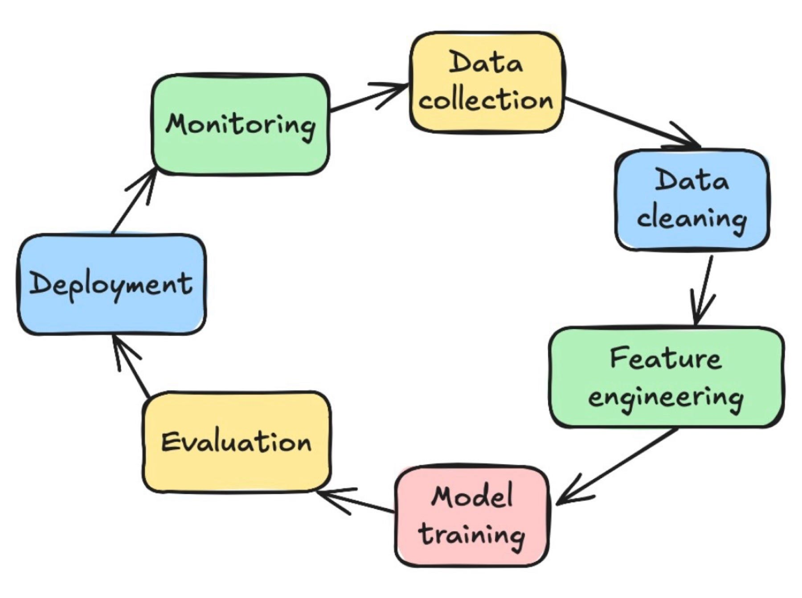

## Machine Learning Life Cycle

### 1. Problem Statement/Requirement Gathering
  
  **Business Problem**
   - What problem are you facing?
   - Why is this important?
   - What is the current process?
   - What pain point exists?
  
  **Objective / Goal**
   - What should the system predict?
   - What decision will be made using predictions?
   - What business outcome matters?

  
  **Success Metrics**

   - Business Metrics  Increase revenue?, Reduce manual work?, Reduce fraud?
, Improve accuracy?.
   - ML Metrics - Accuracy, Precision, Recall, F1-score, RMSE.

  **Defining Input and Output**

   - Input - Salary, Credit score, Age, Employment history
   - Output - Accepted/Rejected

  **Data Avalability**

   - What data do you already have?
   - Where is it stored?
   - How much data exists?
   - Historical data available?
   - Labeled data available?
   - Data quality issues?

  **Current Workflow Understanding**
   - Is the process manual or automated?
   - How are decisions currently made?
   - Existing tools or software?
   - Human involvement?

  **Constraints**
   - Budget constraints
   - Timeline constraints
   - Hardware limitations
   - Cloud or on-premise deployment?
   - Privacy or compliance requirements?

  **Prediction Frequency**
   - Real-time prediction required?
   - Batch prediction sufficient?
   - Daily / hourly / instant predictions?

  **Error Cost Analysis**
   - Which is worse?
     - False Positive
     - False Negative
   - Business impact of wrong predictions?

  **Stakeholders**
   - Who will use the system?
   - Technical or non-technical users?
   - Dashboard or API needed?

  **Explainability Requirements**
   - Does the prediction need explanation?
   - Is model transparency important?
   - Any regulatory requirements?

  **Deployment Requirements**
   - Web application?
   - Mobile application?
   - REST API?
   - Internal dashboard?
   - Third-party integration?

  **Scalability Requirements**
   - Expected number of users?
   - Future data growth?
   - Multi-region or multi-language support?

  **Timeline & Deliverables**
   - MVP deadline
   - Final delivery timeline
   - Demo milestones
   - Phase-wise delivery plan

  **Out of Scope**
   - Clearly define what the system will NOT do

### 2. Data Collection

  **Identify Data Sources**
   - Databases
   - CSV / Excel files
   - APIs
   - Cloud storage
   - Sensors / IoT devices
   - Web scraping
   - User-generated data
   - Third-party datasets

  **Types of Data**
   - Structured Data
     - Tables
     - SQL databases

   - Semi-Structured Data
     - JSON
     - XML
     - Logs

   - Unstructured Data
     - Images
     - Audio
     - Video
     - Text documents

  **Data Requirements**
   - What data is needed for prediction?
   - Which columns/features are useful?
   - Target/output variable available?
   - Historical records available?

  **Data Volume**
   - Number of records
   - Data size in GB/TB
   - Daily/monthly data growth
   - Sufficient data for training?

  **Data Quality Checks**
   - Missing values
   - Duplicate records
   - Incorrect entries
   - Inconsistent formats
   - Noisy data

  **Label Collection**
   - Is labeled data available?
   - Manual labeling required?
   - Auto-generated labels?
   - Label accuracy verified?

  **Data Accessibility**
   - Who owns the data?
   - Access permissions available?
   - API/database credentials required?
   - Data extraction limitations?

  **Data Privacy & Security**
   - Sensitive information present?
   - Personal Identifiable Information (PII)?
   - GDPR / compliance requirements?
   - Data encryption needed?

  **Data Collection Frequency**
   - One-time collection
   - Real-time streaming
   - Daily batch updates
   - Periodic synchronization

  **Data Storage**
   - SQL databases
   - NoSQL databases
   - Data warehouse
   - Data lake
   - Cloud storage

  **Data Validation**
   - Verify schema consistency
   - Validate feature ranges
   - Check label correctness
   - Remove corrupted records

  **Challenges During Data Collection**
   - Insufficient data
   - Imbalanced data
   - Data silos
   - Slow APIs
   - Incomplete historical records

  **Output of Data Collection Phase**
   - Raw dataset
   - Data source documentation
   - Data dictionary
   - Initial data quality report

