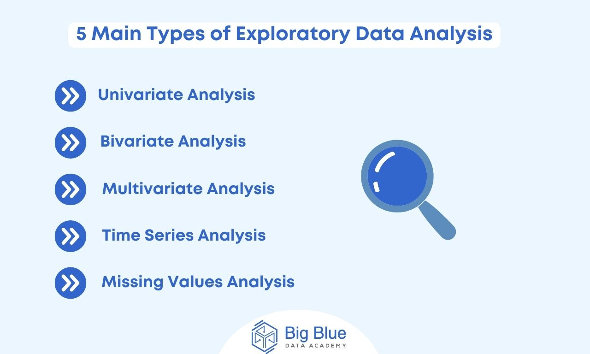

# Exploratory Data Analysis (EDA)



## What is EDA?

EDA (Exploratory Data Analysis) is the step in data analysis where you explore the data to understand:

- What the data contains
- How the data is structured
- Patterns and trends
- Missing values and outliers
- Relationships between variables

**Goal:** To get insights and prepare data for modeling.

> Think of EDA as "understanding your data before doing anything else."

## Why EDA is Important?

| Reason | Explanation |
|--------|-------------|
| Data Quality Check | Identify missing values, errors, duplicates |
| Understand Distributions | Know how values are spread (normal, skewed, etc.) |
| Feature Understanding | Relationships between features & target |
| Model Preparation | Helps in choosing algorithms and preprocessing techniques |

## Types of EDA

EDA can be divided based on techniques used:

### 1. Univariate Analysis

Analysis of one variable at a time.

**Used for:**
- Understanding distribution
- Summary statistics

**Techniques:**

| Data Type | Methods | Plots |
|-----------|---------|-------|
| Numerical | mean, median, mode, std | Histogram, Box Plot |
| Categorical | value counts | Bar Chart, Pie Chart |

### 2. Bivariate Analysis

Analysis of two variables to understand relationship.

**Techniques:**

| Variable Types | Example | Plots |
|----------------|---------|-------|
| Numerical vs Numerical | Height vs Weight | Scatter Plot, Correlation |
| Categorical vs Numerical | Gender vs Salary | Box Plot, Violin Plot |
| Categorical vs Categorical | Gender vs Purchase Decision | Stacked Bar, Heatmap |

### 3. Multivariate Analysis

Analysis of more than two variables simultaneously.

**Used for:**
- Pattern detection
- Feature interactions

**Techniques:**

| Method | Purpose |
|--------|---------|
| Pair Plot | Relationship between many numeric variables |
| Heatmap (Correlation Matrix) | Find strongly related features |
| PCA (Principal Component Analysis) | Reduce dimensionality |

### 4. Descriptive Statistical Analysis

Summarizing data quantitatively:

**Examples:**
- Mean, Median, Mode
- Standard deviation, Variance
- Percentiles, Quartiles

**In Python:**
```python
df.describe()
```

### 5. Graphical / Visual EDA

Understanding data visually.

**Common Plots:**
- Histogram
- Bar Chart
- Scatter Plot
- Heatmap
- Box Plot
- Line Chart

## Short Summary

| Type | What it Studies | Example Question |
|------|-----------------|------------------|
| Univariate | One variable | What is the distribution of age? |
| Bivariate | Two variables | How does income vary with education level? |
| Multivariate | Three or more variables | Which features together influence house price? |