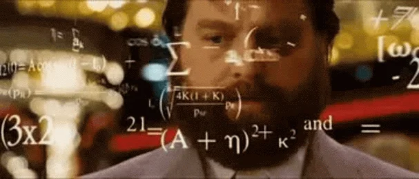

# Probability

Probability is a branch of mathematics and statistics that deals with the likelihood of events occurring. In machine learning, probability theory provides the foundation for many algorithms and statistical methods.

### Definition
The probability of an event is a number between 0 and 1, where:
- 0 means the event will never occur
- 1 means the event will always occur
- Values between 0 and 1 indicate varying degrees of likelihood

### Basic Example
Consider flipping a fair coin:
- Probability of heads = 1/2 = 0.5 = 50%
- Probability of tails = 1/2 = 0.5 = 50%

