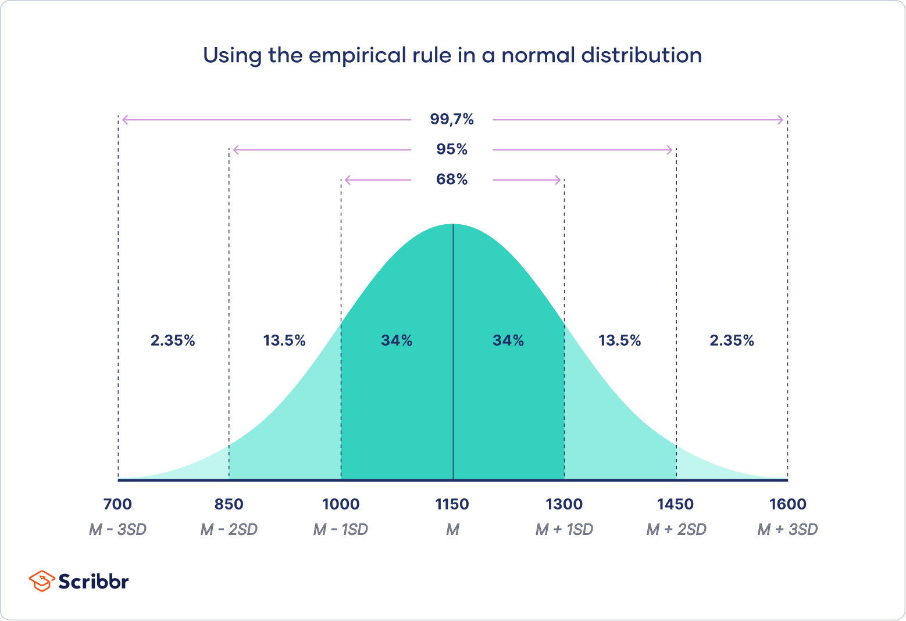

# Probability and Statistics

Probability is a branch of mathematics that deals with the study of random events and the likelihood of their occurrence. It provides a framework for quantifying uncertainty and making predictions based on available information.

Statistics is the branch of mathematics and science focused on collecting, analyzing, interpreting, organizing, and presenting data. It serves as a tool to extract meaningful insights and make informed decisions in the face of uncertainty

---

## Table of Contents

1. [Basics of Probability (Foundation)](#1-basics-of-probability-foundation)
   - 1.1 [Sample Space and Events](#11-sample-space-and-events)
   - 1.2 [Probability Rules: Addition and Multiplication](#12-probability-rules-addition-and-multiplication)
   - 1.3 [Conditional Probability](#13-conditional-probability)
   - 1.4 [Bayes' Theorem](#14-bayes-theorem)
   - 1.5 [Random Variables and Probability Distributions](#15-random-variables-and-probability-distributions)
   - 1.6 [Variance and Standard Deviation](#16-variance-and-standard-deviation)
   - 1.7 [Binomial Distribution](#17-binomial-distribution)
   - 1.8 [Poisson Distribution](#18-poisson-distribution)
   - 1.9 [Normal Distribution](#19-normal-distribution)
   - 1.10 [Hypothesis Testing](#110-hypothesis-testing)

---

## 1. Basics of Probability (Foundation)

### 1.1 Sample Space and Events

#### Sample Space (S)

**Definition:** A sample space is the set of all possible outcomes of a random experiment.

**Examples:**

- **Tossing a coin:**
  
  $S = \{H, T\}$
  
  where $H$ = Head, $T$ = Tail

- **Rolling a die:**
  
  $S = \{1, 2, 3, 4, 5, 6\}$

- **Tossing two coins:**
  
  $S = \{HH, HT, TH, TT\}$

---

#### Event

**Definition:** An event is any subset of the sample space. It consists of one or more outcomes.

**Examples (rolling a die):**

Sample space: $S = \{1, 2, 3, 4, 5, 6\}$

- **Event A:** Getting an even number
  
  $A = \{2, 4, 6\}$

- **Event B:** Getting a number greater than 4
  
  $B = \{5, 6\}$

- **Event C:** Getting a 3
  
  $C = \{3\}$

---

#### Types of Events

| Event Type | Description | Example |
|------------|-------------|---------|
| **Simple Event** | Contains only one outcome | $\{3\}$ |
| **Compound Event** | Contains more than one outcome | $\{2, 4, 6\}$ |
| **Certain Event** | The whole sample space | $S = \{1, 2, 3, 4, 5, 6\}$ |
| **Impossible Event** | No outcomes (empty set) | Getting 7 on a die roll: $\emptyset$ |

---

### 1.2 Probability Rules: Addition and Multiplication

> **Core Concept:** Understanding how to combine probabilities using addition and multiplication rules.

These are the two most important rules in probability for calculating combined probabilities.

---

#### 1.2.1 Addition Rule (OR)

**When to use:** When the question contains **OR** (union of events).

**Formula:**

$$P(A \cup B) = P(A) + P(B) - P(A \cap B)$$

Where:
- $P(A)$ = Probability of event A
- $P(B)$ = Probability of event B  
- $P(A \cap B)$ = Probability of both A and B occurring

**Meaning:**

> Probability of A or B = Probability of A + Probability of B − Probability of both A and B

**Example: Roll a Die**

Find the probability of getting an **even number OR a number greater than 4**.

Sample Space: $S = \{1, 2, 3, 4, 5, 6\}$

Let:
- $A = \{2, 4, 6\}$ (Even numbers)
- $B = \{5, 6\}$ (Numbers greater than 4)

Calculate:
- $P(A) = \frac{3}{6}$
- $P(B) = \frac{2}{6}$
- $P(A \cap B) = \frac{1}{6}$ (Only 6 is common)

Therefore:

$$P(A \cup B) = \frac{3}{6} + \frac{2}{6} - \frac{1}{6} = \frac{4}{6} = \frac{2}{3}$$

**Answer:** $\boxed{\frac{2}{3}}$

---

#### 1.2.2 Multiplication Rule (AND)

**When to use:** When the question contains **AND** (intersection of events).

**Formula (Independent Events):**

$$P(A \cap B) = P(A) \times P(B)$$

Where:
- $P(A)$ = Probability of event A
- $P(B)$ = Probability of event B

**Meaning:**

> Probability of A and B = Probability of A × Probability of B

**Example: Toss a Coin Twice**

Find the probability of getting:
- Head on first toss
- Tail on second toss

Calculate:
- $P(H) = \frac{1}{2}$
- $P(T) = \frac{1}{2}$

Therefore:

$$P(H \cap T) = \frac{1}{2} \times \frac{1}{2} = \frac{1}{4}$$

**Answer:** $\boxed{\frac{1}{4}}$

---

#### 1.2.3 Quick Comparison

| Rule | Keyword | Example |
|------|---------|---------|
| **Addition Rule** | OR | Getting 2 or 4 on a die |
| **Multiplication Rule** | AND | Getting Head and Tail in two tosses |

**Memory Trick:**

- ✅ **OR → Add** → $P(A \cup B)$
- ✅ **AND → Multiply** → $P(A \cap B)$

---

### 1.3 Conditional Probability

> **Core Concept:** Calculating the probability of an event occurring given that another event has already occurred.

**Definition:** Conditional probability helps determine the likelihood of an event $B$ occurring, given that another event $A$ has already happened. The shorthand notation is written as $P(B|A)$ (read as "probability of B given A").

**Formula:**

$$P(B|A) = \frac{P(A \cap B)}{P(A)}$$

Where:
- $P(B|A)$ = Probability of event B given that event A has occurred
- $P(A \cap B)$ = Probability of both A and B occurring (intersection)
- $P(A)$ = Probability of event A

**Key Insight:**

> The calculation is defined as the **intersection** of two events ($A$ and $B$) divided by the probability of the given event ($A$).

---

#### Example 1: Odd Number Given Less Than Four

**Problem:** What is the probability that a dice roll is less than four, given that the roll is an odd number?

**Given:**
- **Event A (Condition):** The roll is an odd number
  - $A = \{1, 3, 5\}$
  - $P(A) = \frac{3}{6} = \frac{1}{2}$

- **Event B:** The roll is less than four
  - $B = \{1, 2, 3\}$
  - $P(B) = \frac{3}{6} = \frac{1}{2}$

**Calculate Intersection:**
- The values common to both events are 1 and 3
- $A \cap B = \{1, 3\}$
- $P(A \cap B) = \frac{2}{6} = \frac{1}{3}$

**Apply Formula:**

$$P(B|A) = \frac{P(A \cap B)}{P(A)} = \frac{\frac{1}{3}}{\frac{1}{2}} = \frac{1}{3} \times \frac{2}{1} = \frac{2}{3}$$

**Answer:** $\boxed{\frac{2}{3}}$

**Interpretation:** Given the roll is odd, the probability it is less than four is $\frac{2}{3}$.

---

#### Example 2: Rolling a '1' Given Odd Number

**Problem:** What is the probability of rolling a '1', given that the result is an odd number?

**Given:**
- **Event A (Condition):** The roll is an odd number
  - $A = \{1, 3, 5\}$
  - $P(A) = \frac{3}{6} = \frac{1}{2}$

- **Event B:** The roll is a '1'
  - $B = \{1\}$
  - $P(B) = \frac{1}{6}$

**Calculate Intersection:**
- The only value common to both events is 1
- $A \cap B = \{1\}$
- $P(A \cap B) = \frac{1}{6}$

**Apply Formula:**

$$P(B|A) = \frac{P(A \cap B)}{P(A)} = \frac{\frac{1}{6}}{\frac{1}{2}} = \frac{1}{6} \times \frac{2}{1} = \frac{1}{3}$$

**Answer:** $\boxed{\frac{1}{3}}$

**Interpretation:** Given the roll is odd, the probability of rolling a '1' is $\frac{1}{3}$.

---

### 1.4 Bayes' Theorem

> **Core Concept:** Updating probabilities based on new evidence using reverse conditional probability.

Bayes' Theorem is a mathematical formula used to calculate the probability of an event based on new evidence. It helps us update an existing probability when additional information becomes available.

**Formula:**

$$P(A|B) = \frac{P(B|A) \cdot P(A)}{P(B)}$$

Where:
- $P(A|B)$ = Probability of event A given that event B has occurred
- $P(B|A)$ = Probability of event B given that event A has occurred
- $P(A)$ = Probability of event A
- $P(B)$ = Probability of event B

**Key Insight:**

> Bayes' Theorem allows us to reverse conditional probabilities, providing a way to update our beliefs based on new evidence.

**Key Distinction:**

*Conditional probability defines the probability of an event given another event, whereas Bayes' theorem provides a way to calculate that conditional probability by reversing known probabilities and incorporating prior information.*

---

### 1.5 Random Variables and Probability Distributions

> **Core Concept:** Representing random outcomes numerically and understanding their probability distributions.

Random variables are numerical representations of outcomes from random processes. They can be classified into two main types: discrete and continuous.

**Discrete Random Variables:** These variables take on a countable number of distinct values. Examples include the number of heads in a series of coin tosses or the number of students in a classroom.

---

#### Example 1: Tossing Two Coins (Discrete Random Variable)

A discrete random variable can take countable values. These values are usually whole numbers like 0, 1, 2, 3, ...

**Problem:** Toss a coin 2 times and count the number of heads.

Let:

$$X = \text{number of heads obtained}$$

**Possible outcomes:**

| Outcome | $X$ |
|---------|-----|
| TT | 0 |
| HT | 1 |
| TH | 1 |
| HH | 2 |

**Possible values of X:**

$$X = \{0, 1, 2\}$$

Since we can count these values (0, 1, or 2 heads), $X$ is a **discrete random variable**.

---

#### Example 2: Rolling a Fair Die

Suppose we roll a die once.

Let:

$$X = \text{number that appears on the die}$$

**Possible values of X:**

$$\{1, 2, 3, 4, 5, 6\}$$

Since a fair die gives each outcome an equal chance:

$$P(X=x) = \frac{1}{6}$$

for every value $x$.

**Probability Distribution Table:**

| $X$ | $P(X)$ |
|-----|--------|
| 1 | $\frac{1}{6}$ |
| 2 | $\frac{1}{6}$ |
| 3 | $\frac{1}{6}$ |
| 4 | $\frac{1}{6}$ |
| 5 | $\frac{1}{6}$ |
| 6 | $\frac{1}{6}$ |

This table is the **probability distribution** of $X$.

---

#### Important Properties of Discrete Probability Distributions

For any discrete probability distribution, the following properties must hold:

**Property 1: Each probability is between 0 and 1**

$$0 \le P(X=x) \le 1$$

**Property 2: Sum of all probabilities equals 1**

$$\sum P(X=x) = 1$$

**Verification for the die example:**

$$\frac{1}{6} + \frac{1}{6} + \frac{1}{6} + \frac{1}{6} + \frac{1}{6} + \frac{1}{6} = 1$$

---

**Continuous Random Variables:** These variables can take on an infinite number of values within a given range. Examples include the height of individuals or the time taken to complete a task.

#### Example 3: Height of Students (Continuous Random Variable)

Suppose we measure the height of students in a classroom.

Let:

$$X = \text{height of a student}$$

**Possible values of X:**

$$X \in [0, \infty)$$

Since height can take any value within a range, $X$ is a **continuous random variable**.

---

### 1.6 Variance and Standard Deviation

> **Core Concept:** Measuring the spread and dispersion of data around the mean.

**Variance**

Variance is the average of the squared differences between each data value and the mean.

**Formula for Variance:**
$$\sigma^2 = \frac{1}{N} \sum_{i=1}^{N} (x_i - \mu)^2$$

Where:
- $\sigma^2$ = Variance
- $N$ = Number of data points
- $x_i$ = Each individual data point
- $\mu$ = Mean of the data

**Standard Deviation**

Standard deviation measures the typical distance of data values from the mean.

**Formula for Standard Deviation:**
$$\sigma = \sqrt{\sigma^2}$$

Where:
- $\sigma$ = Standard Deviation
- $\sigma^2$ = Variance
**Interpretation:**
- A low standard deviation indicates that the data points are close to the mean.
- A high standard deviation indicates that the data points are spread out over a wider range of values.

---

### 1.7 Binomial Distribution

> **Core Concept:** Probability of getting a specific number of successes in a fixed number of independent trials.

The binomial distribution is a discrete probability distribution that describes the number of successes in a fixed number of independent Bernoulli trials, each with the same probability of success.

**Formula for Binomial Probability:**
$$P(X = k) = \binom{n}{k} p^k (1-p)^{n-k}$$
Where:
- $n$ = number of trials
- $k$ = number of successes
- $p$ = probability of success on an individual trial
- $1-p$ = probability of failure on an individual trial

For a binomial distribution, the goal is:

Given n trials, what is the probability of getting exactly x successes?

---

#### Example: Coin Flips

**Problem:** Suppose we flip a coin 5 times. What is the probability of getting exactly 3 heads?

**Given:**
- $n = 5$ (number of trials)
- $k = 3$ (number of successes - heads)
- $p = 0.5$ (probability of heads on a single flip)
- $1 - p = 0.5$ (probability of tails)

**Step 1: Calculate the binomial coefficient**

$$\binom{n}{k} = \binom{5}{3} = \frac{5!}{3!(5-3)!} = \frac{5!}{3! \cdot 2!} = \frac{120}{6 \cdot 2} = 10$$

**Step 2: Apply the binomial formula**

$$P(X = 3) = \binom{5}{3} \cdot (0.5)^3 \cdot (0.5)^{5-3}$$

$$P(X = 3) = 10 \cdot (0.5)^3 \cdot (0.5)^2$$

$$P(X = 3) = 10 \cdot 0.125 \cdot 0.25$$

$$P(X = 3) = 10 \cdot 0.03125$$

$$P(X = 3) = 0.3125 = \frac{5}{16}$$

**Answer:** $\boxed{\frac{5}{16} \approx 0.3125}$ or **31.25%**

**Interpretation:** There is a 31.25% probability of getting exactly 3 heads when flipping a coin 5 times.

---

### 1.8 Poisson Distribution

> **Core Concept:** Probability of a given number of events occurring in a fixed interval when events happen independently at a constant rate.

A Poisson distribution is used to find the probability of how many times an event occurs in a fixed interval of time, area, distance, or space, when the events happen randomly and independently.

**Formula for Poisson Probability:**
$$P(X = k) = \frac{e^{-\lambda} \lambda^k}{k!}$$

Where:
- $k$ = number of occurrences of the event
- $\lambda$ = average number of occurrences in the given interval

#### Example: Call Center Calls

**Problem:** A call center receives an average of 3 calls per hour. What is the probability that they receive exactly 5 calls in the next hour?

**Given:**
- $\lambda = 3$ (average number of calls per hour)
- $k = 5$ (number of calls we want to find the probability for)
**Step 1: Apply the Poisson formula**
$$P(X = 5) = \frac{e^{-3} \cdot 3^5}{5!}$$
**Step 2: Calculate the components**
- $e^{-3} \approx 0.0498$
- $3^5 = 243$
- $5! = 120$
**Step 3: Substitute the values**
$$P(X = 5) = \frac{0.0498 \cdot 243}{120}$$
$$P(X = 5) = \frac{12.1014}{120}$$
$$P(X = 5) \approx 0.1008$$
**Answer:** $\boxed{0.1008}$ or **10.08%**
**Interpretation:** There is a 10.08% probability that the call center will receive exactly 5 calls in the next hour.

---

### 1.9 Normal Distribution

> **Core Concept:** The bell-shaped curve that describes how data is distributed symmetrically around the mean.

**Definition:** Normal distribution is a continuous probability distribution where data is symmetrically clustered around the mean, forming a bell-shaped curve. It is characterized by its mean ($\mu$) and standard deviation ($\sigma$).

**Formula for Normal Distribution:**

$$f(x) = \frac{1}{\sigma\sqrt{2\pi}} e^{-\frac{1}{2}\left(\frac{x-\mu}{\sigma}\right)^2}$$

Where:
- $\mu$ = Mean (center of the distribution)
- $\sigma$ = Standard deviation (measure of spread)
- $\sigma^2$ = Variance
- $x$ = Value of the random variable

**Key Properties:**
- The curve is symmetric about the mean
- Mean = Median = Mode
- Total area under the curve = 1
- The tails extend infinitely in both directions

---

#### The Empirical Rule (68-95-99.7 Rule)

The empirical rule, also known as the **68-95-99.7 rule**, tells you where most of your values lie in a normal distribution:

| Range | Percentage of Data |
|-------|-------------------|
| $\mu \pm 1\sigma$ | Approximately **68%** of values |
| $\mu \pm 2\sigma$ | Approximately **95%** of values |
| $\mu \pm 3\sigma$ | Approximately **99.7%** of values |

**Detailed Breakdown:**

- **68%** of values are within **1 standard deviation** from the mean
  - Range: $[\mu - \sigma, \mu + \sigma]$

- **95%** of values are within **2 standard deviations** from the mean
  - Range: $[\mu - 2\sigma, \mu + 2\sigma]$

- **99.7%** of values are within **3 standard deviations** from the mean
  - Range: $[\mu - 3\sigma, \mu + 3\sigma]$

**Practical Application:**

> This rule is useful for identifying outliers and understanding data spread. Values beyond 3 standard deviations from the mean are rare (only 0.3% of data) and may be considered outliers.

---

#### Example: Student Heights

**Problem:** The heights of students in a school follow a normal distribution with mean $\mu = 170$ cm and standard deviation $\sigma = 10$ cm.

**Apply the Empirical Rule:**

- **68% of students** have heights between:
  - $170 - 10 = 160$ cm and $170 + 10 = 180$ cm

- **95% of students** have heights between:
  - $170 - 2(10) = 150$ cm and $170 + 2(10) = 190$ cm

- **99.7% of students** have heights between:
  - $170 - 3(10) = 140$ cm and $170 + 3(10) = 200$ cm

**Interpretation:** Most students (68%) are between 160-180 cm tall, while very few students (<0.3%) are shorter than 140 cm or taller than 200 cm.

---

### 1.10 Hypothesis Testing

> **Core Concept:** Statistical method to test claims about a population using sample data.

Hypothesis testing is a statistical method used to make inferences or draw conclusions about a population based on sample data. It involves formulating two competing hypotheses and using sample data to determine which hypothesis is more likely to be true.

**Common Hypothesis Testing Methods:**
1. Z-test
2. T-test
3. Chi-square test
4. ANOVA (Analysis of Variance)

**Steps in Hypothesis Testing:**

1. **State the Hypotheses:**
   - Null Hypothesis ($H_0$): A statement of no effect or no difference
   - Alternative Hypothesis ($H_1$ or $H_a$): A statement that contradicts the null hypothesis

2. **Choose a Significance Level ($\alpha$):**
   - Common choices are 0.05, 0.01, or 0.10

3. **Select the Appropriate Test:**
   - Depending on the data type and sample size, choose a statistical test (e.g., t-test, z-test, chi-square test, ANOVA)

4. **Calculate the Test Statistic:**
   - Use the sample data to compute the test statistic (e.g., t-value, z-value)

5. **Make a Decision:**
   - Compare the test statistic to the critical value or use the p-value approach to decide whether to reject or fail to reject the null hypothesis

6. **Draw a Conclusion:**
   - Based on the decision, draw a conclusion about the population in the context of the research question

---

#### Example: Coin Toss Hypothesis Test

**Problem:** A coin is tossed 100 times, and it lands on heads 60 times. We want to test if the coin is fair (i.e., has an equal chance of landing on heads or tails).

**Step 1: State the Hypotheses**

- **Null Hypothesis ($H_0$):** The coin is fair, $p = 0.5$
- **Alternative Hypothesis ($H_1$):** The coin is not fair, $p \neq 0.5$

**Step 2: Choose a Significance Level**

- Let $\alpha = 0.05$

**Step 3: Select the Appropriate Test**

- Since we are dealing with proportions, we use a **z-test for proportions**

**Step 4: Calculate the Test Statistic**

The test statistic for a z-test for proportions is:

$$z = \frac{\hat{p} - p_0}{\sqrt{\frac{p_0 (1 - p_0)}{n}}}$$

Where:
- $\hat{p}$ = sample proportion
- $p_0$ = hypothesized population proportion
- $n$ = sample size

**Calculate the components:**
- $\hat{p} = \frac{60}{100} = 0.6$ (sample proportion)
- $p_0 = 0.5$ (hypothesized proportion for a fair coin)
- $n = 100$ (sample size)

**Substitute the values:**

$$z = \frac{0.6 - 0.5}{\sqrt{\frac{0.5 \times (1 - 0.5)}{100}}}$$

$$z = \frac{0.1}{\sqrt{\frac{0.25}{100}}}$$

$$z = \frac{0.1}{\sqrt{0.0025}}$$

$$z = \frac{0.1}{0.05}$$

$$z = 2.0$$

**Step 5: Make a Decision**

For a two-tailed test at $\alpha = 0.05$, the critical z-values are $\pm 1.96$.

- If $|z| > 1.96$, reject $H_0$
- Since $z = 2.0 > 1.96$, we **reject the null hypothesis**

Alternatively, using the p-value approach:
- For $z = 2.0$, the p-value $\approx 0.0455$
- Since $p\text{-value} < 0.05$, we **reject the null hypothesis**

**Step 6: Draw a Conclusion**

**Conclusion:** There is sufficient evidence at the 0.05 significance level to conclude that the coin is **not fair**. The coin appears to be biased toward heads.

---

**Key Takeaway:**

*Hypothesis testing is a statistical technique used to determine whether there is enough evidence in sample data to support a claim about a population is true or not. It involves formulating null and alternative hypotheses, selecting a significance level, calculating a test statistic, and making a decision based on the results.*

---

## Summary

This comprehensive guide covers the fundamental concepts of probability and statistics, from basic probability rules to advanced topics like hypothesis testing. Each concept builds upon the previous ones, creating a solid foundation for statistical analysis and machine learning applications.

**Key Topics Covered:**
- ✅ Sample spaces, events, and basic probability rules
- ✅ Conditional probability and Bayes' theorem
- ✅ Random variables and probability distributions
- ✅ Variance, standard deviation, and data dispersion
- ✅ Binomial, Poisson, and Normal distributions
- ✅ Hypothesis testing and statistical inference

These concepts are essential for understanding data analysis, machine learning algorithms, and making data-driven decisions.